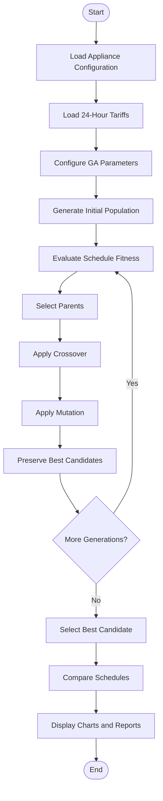

# Genetic Algorithm Workflow

```mermaid
flowchart TD
    A(["Start"]) --> B["Load Appliance Configuration"]
    B --> C["Load 24-Hour Tariffs"]
    C --> D["Configure GA Parameters"]
    D --> E["Generate Initial Population"]
    E --> F["Evaluate Schedule Fitness"]
    F --> G["Select Parents"]
    G --> H["Apply Crossover"]
    H --> I["Apply Mutation"]
    I --> J["Preserve Best Candidates"]
    J --> K{"More Generations?"}
    K -- Yes --> F
    K -- No --> L["Select Best Candidate"]
    L --> M["Compare Schedules"]
    M --> N["Display Charts and Reports"]
    N --> O(["End"])
```
